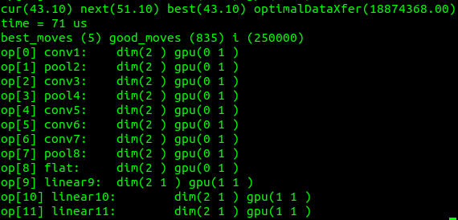
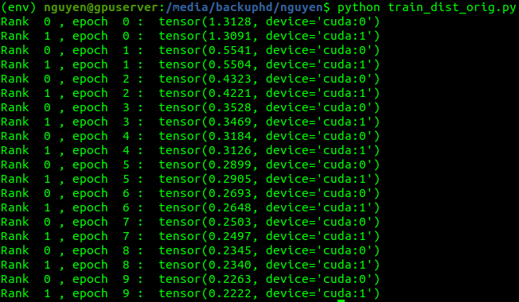
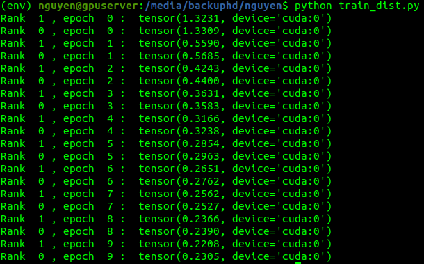

# FlexFlow's execution optimiser and torch.distributed

## Get optimised strategy for AlexNet
### Clone FlexFlow repo
`$ git clone https://github.com/flexflow/FlexFlow.git`

### Go to the directory of the execution optimiser
`$ cd FlexFlow/scripts/`

### Modify the implementation of the optimiser to build AlexNet
1. Open `simulation.cc` with a text editor.
2. locate the `main()` function.
3. With in `main()` function definition, replace the line `build_nmt_model();` with `build_alexnet_model();`.
4. Replace `NUM_NODES = 2;` with the corresponding nodes (1 in this case);
5. Replace `WORKERS_PER_NODE = 4;` with the actual "workers" (physical CPUs, GPUs for computation) (2 GPUs in this case);

### Compile the code of the optimiser
Replace `-arch=compute_XX` and `-code=sm_XX` with the actual compute capability (GeForce 1080Ti with the compute capability of 6.1 in this case). This can be retrieved from [CUDA GPUS | NVIDIA](https://developer.nvidia.com/cuda-gpus)

`$ nvcc simulator.cc -lcudnn -lcublas -std=c++11 -arch=compute_61 -code=sm_61`

**In case there is no `nvcc`, this executable of NVIDIA (R) Cuda compiler driver shoulde be install with CUDA and usually located at `/usr/local/cuda/bin/nvcc`**

_If there are any compilation failures, due to constant changes from the author, please fall back to old commits by checking out this specific commit `a5066723bad1fd0b2b65c7d7ff0f84739e55ca4d`_

### Run the execution optimiser with AlexNet architecture on the selected device topology
1. Simply run the executable after successfully compiled it with `nvcc`
`$ ./a.out`

1. The result should look like this in the end.

## Build a AlexNet-like (simpler than AlexNet) with `torch.distributed`.
0. Install PyTorch (1.2.0 for CUDA 10.0 in this example) with this script (a `virtualenv` might be necessary) with
`pip install torch==1.2.0 torchvision==0.4.0`.
1. Visit and follow the `torch.distributed` tutorials on [Writing Distributed Applications with PyTorch — PyTorch Tutorials](view-source:https://pytorch.org/tutorials/intermediate/dist_tuto.html)
2. In the end, one working example script should look like in `train_dist_orig.py`.
3. The result should look like this
4. The result should look like this in the end.

_Distributed data communitation backend between computation devices could be switched to `nccl`, since `nccl` support better communication of GPU-to-GPU for NVIDIA GPUs_.

## Modify this script as in the Appendix from the Technical Report to get `train_dist.py`
1. Refer to the modification and implementation to achieve the script like `train_dist.py`.
2. Run this script, and the result should look like this.
